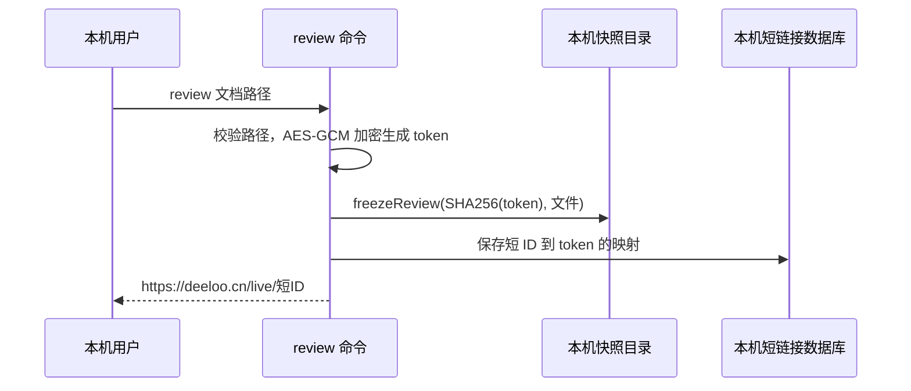
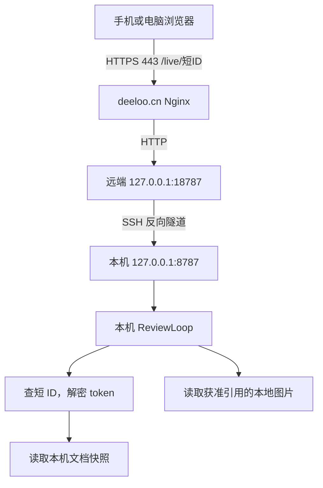

# `review` 公网 URL 的生成与访问链路

核实日期：2026-09-08。本文记录 `/live/` 当前实现及 `deeloo.cn` 到本机的部署方式。

`review <本地文件>` 在本机生成审阅快照和访问凭证，输出公网链接。命令不上传文档到云端，也不启动隧道；链接依靠预先运行的 Nginx、SSH 反向隧道和本机 ReviewLoop 服务提供访问。主文档会复制到本机快照目录，Markdown 引用的本地图片则从原位置读取。

本文与 [旧文档审阅部署记录](deeloo-cn-cash-in-system-research.md) 描述不同链路：旧记录中的 `/document-reviews/`、远端 `/opt/reviewloop` 和 5173 端口，不是当前 `/live/` 主文档的服务位置。

## 1. 使用入口

```bash
review /home/ldd/path/document.md
# 输出：https://deeloo.cn/live/<短ID>

review /home/ldd/path/document.md --long
# 输出：https://deeloo.cn/live/<完整token>
```

支持 Markdown、图片、PDF、Word、PowerPoint 和 Excel；多个文件的审阅仅支持图片。目录参数的选择规则见 `bin/review.js`，本文主要说明单个文件的发布链路。

默认 URL 前缀为 `https://deeloo.cn/live`，可以通过 `ONLINE_REVIEW_BASE_URL` 更改。更改前缀只改变输出地址，不会自动配置 DNS、HTTPS、反向代理或隧道。

添加 `--local` 会生成 `http://127.0.0.1:8787/live` 回环地址；添加 `--localnet` 会忽略 TUN 和 WSL 接口并自动查找局域网 IPv4，存在多个地址时列出剩余网卡供选择，脚本可用 `--localnet=<IP>` 指定。两者设置 `PORT` 时使用该端口，否则使用 8787，不再需要配置本地 Base URL。局域网模式要求服务监听 `0.0.0.0`。这些选项不启动服务、不经过隧道；最新评审记录会保留所选 URL，所以不带参数的 `review feedback` 同样直连该地址。

添加 `--tailnet` 会先探测显式 `PORT`、5173 和 8787 上正在运行的 ReviewLoop，再执行 `tailscale funnel --bg --yes <PORT>`，把本机回环服务通过持久化的公网 HTTPS Funnel 暴露，并生成当前节点的 `https://<machine>.<tailnet>.ts.net/live/...` 地址。没有可连接的本地服务时命令直接失败，不会生成 502 链接。Tailscale 必须已连接且允许使用 Funnel；运行 `tailscale funnel reset` 可关闭该持久化入口。

## 2. 命令如何生成 URL

实现入口：[bin/review.js](../../bin/review.js)。

1. 解析参数、规范化文件路径并验证文件类型和大小。
2. 单文件以路径字符串作为 payload，多图片以路径数组的 JSON 作为 payload。
3. 用 `ONLINE_REVIEW_URL_SECRET` 的 SHA-256 摘要作为 AES-256-GCM 密钥，生成随机的 12 字节 IV，对 payload 加密。
4. 将 `IV + 16 字节认证标签 + 密文` 编码为 base64url，得到完整 token。token 携带加密路径，不包含文档内容。
5. 调用 `freezeReview(digest(token), files)`，将当前主文件字节写入本机快照目录。
6. 默认生成 6 个随机字节并编码为 base64url，得到 8 字符短 ID；将 `短 ID → 完整 token` 写入本机 SQLite 数据库。
7. 输出 `BASE_URL/短ID`。使用 `--long` 或短链接写入失败时输出 `BASE_URL/完整token`。

每次发布使用新的随机 IV，因此重新运行命令会生成新的审阅凭证及快照标识。修改主文件不会改变已经发布的快照；要审阅新版本，应重新运行 `review`。



## 3. 浏览器如何访问本机文档



请求逐层原路返回浏览器。公网服务器转发请求和响应；主文档快照及短链接映射保存在本机。

服务端解析见 [shortLinks.ts](../../src/lib/server/shortLinks.ts) 和 [live/snapshots.ts](../../src/lib/server/live/snapshots.ts)：

1. `resolveToken()` 查询短 ID；没有映射时按完整 token 尝试处理。
2. `decodePaths()` 解码并验证 AES-GCM token，恢复原始文件路径。
3. `liveSnapshot()` 使用完整 token 的 SHA-256 定位快照。已有 manifest 时复用快照；历史链接尚无快照时，在首次读取时冻结文件。
4. `/live/[token]` 页面及其资源接口读取快照并展示对应格式。

CLI 与服务必须使用相同的 URL 密钥、短链接数据库和快照目录。仅将 URL 发给另一台未共享这些数据的服务器，不能使其读取本机文档。

## 4. 当前部署位置与端口

| 部件 | 当前配置 |
| --- | --- |
| 本机项目 | `/home/ldd/reviewloop` |
| 本机 Web 服务 | 用户级 `online-review.service` |
| Web 入口 | `/usr/bin/node /home/ldd/reviewloop/build/index.js` |
| 本机监听 | `127.0.0.1:8787` |
| 公网 Origin | `https://deeloo.cn` |
| 隧道服务 | 用户级 `online-review-tunnel.service` |
| SSH 目标 | `ubuntu@deeloo.cn` |
| 远端转发监听 | `127.0.0.1:18787` |
| 公网反代 | Nginx `/live/` → `http://127.0.0.1:18787` |

本机服务单元位于 `~/.config/systemd/user/`。Web 服务使用 `NODE_ENV=production`、`HOST=127.0.0.1`、`PORT=8787`、`ORIGIN=https://deeloo.cn`，从 `~/.config/online-review.env` 加载环境配置。

反向隧道的核心命令如下：

```bash
ssh -i /home/ldd/pems/deeloo.cn.pem \
  -o BatchMode=yes -o IdentitiesOnly=yes \
  -o ExitOnForwardFailure=yes \
  -o ServerAliveInterval=30 -o ServerAliveCountMax=3 \
  -o TCPKeepAlive=yes -o ConnectTimeout=10 \
  -N -R 127.0.0.1:18787:127.0.0.1:8787 ubuntu@deeloo.cn
```

`-R` 表示远端收到的 18787 请求通过 SSH 连接交回本机，再连接本机 8787。18787 只绑定远端回环地址，由 Nginx 对外提供 HTTPS。

当前静态资源存在新旧服务并存配置：`/_app/` 先代理到远端 `127.0.0.1:5173`，遇到配置指定的 404 或 502 时，回退至命名 location `@live_app`，再代理到 18787。因此，排查“页面 HTML 能打开但交互失效”时，也要检查 `/_app/`，不能只检查 `/live/`。

## 5. 本机数据与配置

| 项目 | 环境变量或默认位置 | 用途 |
| --- | --- | --- |
| URL 前缀 | `ONLINE_REVIEW_BASE_URL`，默认 `https://deeloo.cn/live` | CLI 输出地址 |
| URL 密钥 | `ONLINE_REVIEW_URL_SECRET` | 加密和验证路径 token |
| CLI 密钥回退配置 | `~/.config/online-review.env` | CLI 未从环境取得密钥时读取 |
| 短链接数据库 | `ONLINE_REVIEW_SHORT_LINKS_DB`，默认 `~/.config/online-review-links.db` | `short_links` 表保存 ID、token、创建时间 |
| 快照及反馈根目录 | `ONLINE_REVIEW_FEEDBACK_HOME`，默认 `~/.config/online-review-feedback` | 保存快照及相关反馈数据 |
| 主文件快照 | `<反馈根目录>/snapshots/<SHA256(token)>/<文件序号>/<文件名>` | 发布时固定的文件字节 |
| 快照 manifest | 同一快照目录下的 `manifest.json` | 文件名、哈希、大小、快照路径及版本 |

备份与迁移需要同时考虑密钥、短链接数据库和快照/反馈目录。SQLite 使用 WAL 模式，备份应使用一致性备份方式或在停止相关写入后操作。快照 manifest 中含本机绝对路径，迁移目录时还需适配路径，不能假设复制数据库就足够。

链接本身是访问凭证；当前 token 未包含自动过期时间。本文不记录密钥、私钥内容或实际审阅 token。

## 6. Markdown 图片与图表

- Markdown 主文件使用快照；引用的本地图片不复制到快照目录。
- 本地图片经 `/live/<token或短ID>/assets/<图片ID>` 读取原文件；相对路径以原 Markdown 所在目录解析。
- 仅允许快照 Markdown 实际引用的图片，且真实路径必须位于原文档目录或其子目录中，含符号链接目标检查。
- 原图片更新会影响后续展示，删除或移动图片会使其不可用。因此，主文件已冻结并不意味着依赖图片也已冻结。
- Mermaid 代码块由浏览器加载项目提供的 Mermaid 库生成 SVG，无需浏览器扩展、外部图表服务或预先生成图片文件。

图片实现见 [markdownAssets.ts](../../src/lib/server/live/markdownAssets.ts)；反馈详情见 [Live review feedback](../live-feedback.md)。

## 7. 运行与排障

查看本机服务状态和最近日志：

```bash
systemctl --user status online-review.service online-review-tunnel.service
journalctl --user -u online-review.service -n 80 --no-pager
journalctl --user -u online-review-tunnel.service -n 80 --no-pager
```

更新应用代码后，先构建成功，再重启 Web 服务：

```bash
cd /home/ldd/reviewloop
pnpm run build && systemctl --user restart online-review.service
```

修改 systemd 单元后需执行 `systemctl --user daemon-reload`。只有隧道需要恢复时才重启它：

```bash
systemctl --user restart online-review-tunnel.service
```

使用同一个有效短 ID，从内向外检查；将下面的 `REVIEW_ID` 替换为待排查链接中的 ID：

```bash
# 本机 Web 服务
curl -I 'http://127.0.0.1:8787/live/REVIEW_ID'

# 远端回环端口：验证 SSH 转发
ssh -i /home/ldd/pems/deeloo.cn.pem ubuntu@deeloo.cn \
  "curl -I --max-time 10 'http://127.0.0.1:18787/live/REVIEW_ID'"

# 完整公网链路
curl -I 'https://deeloo.cn/live/REVIEW_ID'
```

| 现象 | 优先检查 |
| --- | --- |
| 命令生成了 URL，但公网 502/504 | 本机是否在线、Web 服务状态、隧道状态、远端监听及 Nginx upstream |
| 本机正常，远端 18787 超时 | SSH 转发是否有效；远端监听存在不代表隧道仍能传输 |
| 隧道报远端端口转发失败 | 18787 是否被其他或遗留连接占用；确认所有者后处理，勿直接终止未知进程 |
| 链接 404 | 短 ID 映射、CLI/服务密钥一致性、快照是否可用 |
| HTML 正常，图表或按钮失效 | 浏览器 JS 错误及 `/_app/` 资源请求，新旧服务的回退配置 |
| 文档正常，本地图片失败 | 原图片是否存在、是否仍在允许目录内、大小与格式限制 |
| 修改主文档后旧链接没有变化 | 预期的快照行为，重新运行 `review` 发布新版本 |

本机休眠、关机、断网或隧道中断期间，依赖本机的公网审阅无法正常访问。URL 生成成功只说明本地发布步骤成功，不等于公网链路已通过连通性检查。
