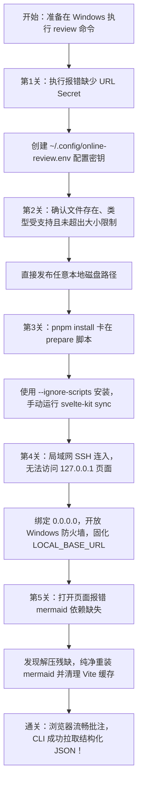

# ReviewLoop 在 Windows 上的本地审阅探索与避坑指南

> **导读**：本文记录了在 Windows 环境（尤其是在通过 SSH 远程登录、局域网协同的开发机场景下）跑通 ReviewLoop `review` 命令的全过程“心路历程”。其中包含了对底层设计逻辑的剖析、旧版路径限制、pnpm 脚本、防火墙与局域网绑定、依赖缺失排查以及应对方案。
>
> 如果你是刚接触这个项目的新用户，无论是想在自己的 Windows PC 上体验，还是在团队内部局域网搭建私有审阅节点，本文都可以作为完整的实战参考。

---

## 目录
- [一、背景认知：ReviewLoop 是什么？](#一背景认知reviewloop-是什么)
- [二、初次上手与心路历程（踩坑全记录）](#二初次上手与心路历程踩坑全记录)
  - [第 1 关：加密密钥缺失与环境配置文件](#第-1-关加密密钥缺失与环境配置文件)
  - [第 2 关：旧版 Windows 路径限制](#第-2-关旧版-windows-路径限制)
  - [第 3 关：Windows 下 `pnpm install` 挂起与生命周期脚本问题](#第-3-关windows-下-pnpm-install-挂起与生命周期脚本问题)
  - [第 4 关：局域网访问、IP 绑定与 Windows 防火墙](#第-4-关局域网访问ip-绑定与-windows-防火墙)
  - [第 5 关：前端转译报错与幽灵缺失的 `mermaid`](#第-5-关前端转译报错与幽灵缺失的-mermaid)
  - [第 6 关：打通闭环：从页面标注到 AI 结构化拉取](#第-6-关打通闭环从页面标注到-ai-结构化拉取)
- [三、新用户 5 分钟快速上手指南 (Quick Start)](#三新用户-5-分钟快速上手指南-quick-start)
- [四、常用命令速查手册](#四常用命令速查手册)

---

## 一、背景认知：ReviewLoop 是什么？

在传统的人工与 AI 协作过程中，AI 生成的代码或长文档往往存在一个痛点：**人类很难在一个稳定、精确定位的地方留下修改意见**。如果直接在聊天框里粘贴文本，AI 很难获知“你到底指的是第几行、哪个段落、哪个视频帧”。

ReviewLoop 正是为此而设计的 **Human-in-the-Loop 审阅中枢**：
1. **只读快照（Read-only Snapshot）**：发布审阅时，不会修改原始文件，而是把当前文件内容冻结并哈希存储，保证审阅过程的不可篡改。
2. **轻量鉴权（Encrypted Capability Token）**：通过 AES-256-GCM 将文件原始路径和随机 IV 加密，生成可访问的短链接。
3. **富媒体与交互批注**：支持 Markdown、HTML、PDF、Word、PPT、Excel、图片以及带时间轴和帧级控制的视频。
4. **结构化反馈闭环**：审阅者在浏览器点击“提交给 AI”后，AI 或脚本可以通过 `review feedback --json` 直接拉取精确锚定到行/块/坐标/时间帧的机器可读 JSON 数据。

---

## 二、初次上手与心路历程（踩坑全记录）

回顾这次在 Windows 上使用 `review` 命令的全过程，可谓“关卡重重”，但每一步背后都有清晰的系统设计逻辑。



---

### 第 1 关：加密密钥缺失与环境配置文件

- **遇到的现象**：
  第一次尝试在终端运行 `node bin/review.js README.md` 时，控制台立即弹错：
  ```text
  ENOENT: no such file or directory, open 'C:\Users\Administrator\.config\online-review.env'
  ```
- **原因剖析**：
  查阅 [`bin/review.js`](file:///D:/proj/reviewloop/bin/review.js) 中的 `secret()` 方法发现，`review` 工具需要一个名为 `ONLINE_REVIEW_URL_SECRET` 的密钥，通过 SHA-256 派生出 AES-256-GCM 密钥，用于加密审阅路径。如果环境变量没有提供，它会默认寻找 `~/.config/online-review.env`。而刚克隆下来的 Windows 新机器上并没有这个文件。
- **解法**：
  在用户目录创建该文件并写入随机密钥：
  ```powershell
  Set-Content -Path "$HOME\.config\online-review.env" -Value "ONLINE_REVIEW_URL_SECRET=demo-secret-key-for-local-reviewloop-2026" -Encoding utf8
  ```

---

### 第 2 关：旧版 Windows 路径限制

- **旧版现象**：`review` 曾只允许发布 `$HOME` 或 `/tmp` 下的文件，因此 Windows 常见的 `D:\proj\...` 工作区会被拒绝。
- **当前行为**：该目录白名单已经移除，可以直接发布任意本地磁盘路径。命令仍会解析真实路径，并校验目标是普通文件、文件类型受支持且大小未超出限制；发布后使用冻结快照提供内容。

---

### 第 3 关：Windows 下 `pnpm install` 挂起与生命周期脚本问题

- **遇到的现象**：
  为了启动 Web 服务来渲染前端，我执行了 `pnpm install`，结果进程持续十几分钟挂起，无任何输出，CPU 仅占用了少量时间后停滞。
- **原因剖析**：
  查看 [`package.json`](file:///D:/proj/reviewloop/package.json) 发现在 `scripts` 中定义了：
  ```json
  "prepare": "svelte-kit sync || echo ''"
  ```
  `pnpm install` 会在收尾阶段自动触发 `prepare` 脚本。项目现在直接执行 `svelte-kit sync`，可在 Windows 和 POSIX 环境中一致运行。
- **解法**：
  在 Windows 下使用 `--ignore-scripts` 绕过钩子：
  ```powershell
  pnpm install --ignore-scripts
  pnpm exec svelte-kit sync
  ```
  原来卡了十几分钟的过程，仅仅 **11 秒** 即可完成依赖安装和 SvelteKit 的工程初始化！

---

### 第 4 关：局域网访问、IP 绑定与 Windows 防火墙

- **遇到的现象**：
  由于我是通过 SSH 远程登录这台 Windows 工作站，我需要用客户端电脑的浏览器打开审阅页面。但默认情况下：
  1. Vite 启动只绑定 `127.0.0.1`，外部机器无法连接。
  2. `review` 默认和 `--local` 都使用 `127.0.0.1:8787`，`--localnet` 才使用局域网地址。
  3. Windows Defender 防火墙默认阻断了外部对非标准端口（5173）的访问。
- **解法**：
  1. **服务监听全网卡**：启动 Vite 时显式传入 `--host 0.0.0.0 --port 5173`。
  2. **开放入站端口**：使用管理员权限执行一条 netsh 命令，放行 5173 端口：
     ```powershell
     netsh advfirewall firewall add rule name="ReviewLoop 5173" dir=in action=allow protocol=TCP localport=5173
     ```
  3. **使用局域网选项**：
     执行 `review <file> --localnet`。只有一个私有 IPv4 时直接使用；存在多个时命令会列出网卡和地址供选择。服务运行在 5173 时可先设置 `PORT=5173`，脚本也可使用 `--localnet=<IP>` 明确选择。

---

### 第 5 关：前端转译报错与幽灵缺失的 `mermaid`

- **遇到的现象**：
  配置好局域网 IP 后，在客户端浏览器打开链接，页面白屏，控制台与后台报错：
  ```text
  [plugin:vite:import-analysis] Failed to resolve import "mermaid" from "src/lib/markdown/mermaid.ts". Does the file exist?
  ```
- **原因剖析**：
  排查发现，[`src/lib/markdown/mermaid.ts`](file:///D:/proj/reviewloop/src/lib/markdown/mermaid.ts) 中存在动态引入 `import('mermaid')`。
  而使用 `Test-Path node_modules/mermaid` 检查确实返回 `True`，但在仔细检查其 `dist/` 目录时惊奇地发现：
  > 里面只有 `mermaid.core.mjs.map`，却没有 `mermaid.core.mjs` 主文件！
  原来是第 3 关中最初被强行终止的安装进程，导致 `mermaid` 包解压到一半就中断了。后续 pnpm 检查文件夹已存在，就略过了它。
- **解法**：
  1. 彻底删除破损的包并重装：
     ```powershell
     Remove-Item -Recurse -Force node_modules\mermaid
     pnpm add mermaid@11.17.2 --ignore-scripts
     ```
  2. 删除 `node_modules/.vite` 预编译缓存。
  3. 重启 Vite 服务，`mermaid` 被正确转译优化，页面秒级打开！

---

### 第 6 关：打通闭环：从页面标注到 AI 结构化拉取

一切就绪后，迎来了最激动人心的闭环验证：

1. **发布文档**：
   ```powershell
   $env:PORT=5173
   review "$HOME\review-demo\sample.md" --localnet
   # 输出：http://192.168.10.103:5173/live/dk_ainX8
   ```
2. **页面评审交互**：
   在客户端浏览器中打开网页，页面不仅完整渲染了标题、正文、代码高亮，而且每一段都有对应的块标记（如 `L1`, `L3`, `L5`）。
   用鼠标选中第一行正文 `"ReviewLoop"`，右侧弹出意见面板，输入评语并点击 **“提交给 AI”**。
3. **CLI 拉取反馈**：
   回到 SSH 终端，执行：
   ```powershell
   node bin/review.js feedback --json
   ```
   终端瞬间输出了结构化的 JSON 响应！

```json
{
  "schemaVersion": 1,
  "review": {
    "id": "7c7c9fd1...",
    "kind": "markdown"
  },
  "batches": [
    {
      "id": "93de0274-1ad1-439b-b8c7-61344e8431a2",
      "status": "submitted",
      "comments": [
        {
          "id": "ann-1",
          "body": "这里建议增加一个英文副标题，以便更好地国际化展示。",
          "anchor": {
            "type": "document-text",
            "blockId": "L1",
            "selectedText": "ReviewLoop",
            "suffix": " 本地快速体验文档"
          }
        }
      ]
    }
  ]
}
```
**至此，整套“发布快照 → 人工页面划词 → 提交意见 → 机器自动接收”的完整闭环，在 Windows 上圆满跑通！**

---

## 三、新用户 5 分钟快速上手指南 (Quick Start)

如果你是一位新的 Windows 开发者，希望在本地最快速度上手使用 ReviewLoop，请直接按照以下顺序操作：

### 1. 准备环境配置
确保已经安装 Node.js 24+（自带 `node:sqlite`）。在 PowerShell 中执行：
```powershell
# 1. 创建 ~/.config 目录及密钥配置文件
$cfg = @"
ONLINE_REVIEW_URL_SECRET=my-custom-reviewloop-secret-2026
"@
Set-Content -Path "$HOME\.config\online-review.env" -Value $cfg -Encoding utf8

# 2. 设置用户级环境变量
[Environment]::SetEnvironmentVariable("ONLINE_REVIEW_URL_SECRET", "my-custom-reviewloop-secret-2026", "User")
```

### 2. 安装依赖并初始化
进入项目根目录：
```powershell
# 使用 --ignore-scripts 避免 Windows 生命周期脚本卡顿
pnpm install --ignore-scripts

# 生成 SvelteKit 依赖文件
pnpm exec svelte-kit sync
```

### 3. 放行防火墙并启动 Web 服务
```powershell
# 管理员身份放行 5173 端口（局域网协作必选，仅本机可忽略）
netsh advfirewall firewall add rule name="ReviewLoop 5173" dir=in action=allow protocol=TCP localport=5173

# 启动 Web 页面服务（监听全网卡）
pnpm exec vite dev --host 0.0.0.0 --port 5173
```

### 4. 发布你的第一个审阅！
注意：待审阅的文件**请放在你的用户目录 (`$HOME`，即 `C:\Users\<你的名字>\`) 下**：
```powershell
# 示例：发布一个 Markdown 文档
node bin/review.js "$HOME\Documents\my-plan.md" --local
```
终端会输出形如 `http://192.168.10.103:5173/live/<短ID>` 的链接。在浏览器中打开它即可开始审阅！

---

## 四、常用命令速查手册

| 场景 | 命令 | 说明 |
| :--- | :--- | :--- |
| **审阅指定文件** | `node bin/review.js "$HOME/path/file.md" --local` | 必须位于 `$HOME` 目录下 |
| **审阅剪贴板内容** | `node bin/review.js --clipboard --local` | 自动从 Windows 剪贴板提取并发布 |
| **终端交互粘贴审阅** | `node bin/review.js paste --local` | 终端粘贴后回车 + `Ctrl+D` 发布 |
| **管道输入审阅** | `Get-Content doc.md \| node bin/review.js paste --local` | 适合脚本衔接 |
| **查看最新审阅反馈** | `node bin/review.js feedback --json` | 获取最近一次发布的审阅的最新评论 |
| **等待人工提交反馈** | `node bin/review.js feedback --wait --json` | 挂起直到用户在浏览器点击“提交给 AI” |
| **下载批注与原始快照** | `node bin/review.js feedback --out ./feedback-dir` | 下载包含标记的 PNG 及原文件 |

---
*本文档由实践记录沉淀，更新于 2026 年 9 月。*
